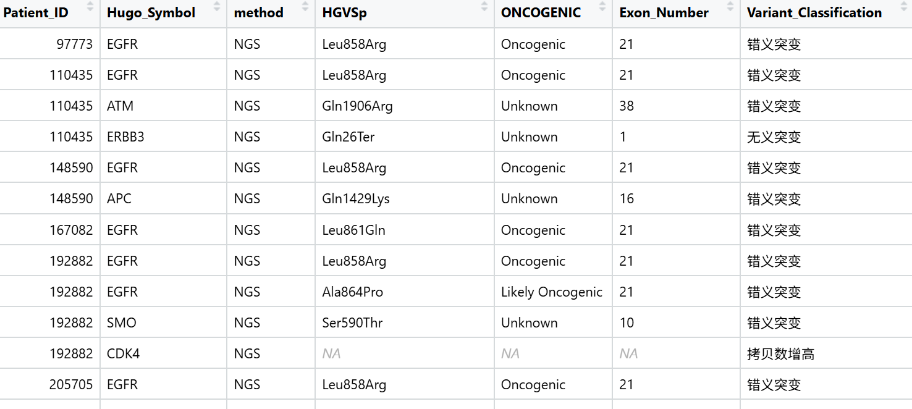

# 将NGS弄好的Excel表格里面的突变正常可以供R语言使用的纵数据(What)

* 2025/8/14 (When)

*生信技能树服务器 /home/data/t190513/molecular_staging/2.analysis/1-1 NGS-突变整理成纵数据.R (Where)\

(Why)
见标题

##                                     加载包(How)

```
library(tidyr)
library(dplyr)
library(stringr)
```

## 加载文件(How)

```
NGS_raw_table <- read.csv("~/molecular_staging/1.resources/NGS用于R语言输入.csv")
NGS_mutoncokb <- read.delim("~/molecular_staging/1.resources/NGS.oncokb.txt")
NGS_mutoncokb <- NGS_mutoncokb[!(NGS_mutoncokb$HGVSp %in% c("","?")),]
NGS_fusiononcokb <- read.delim("~/molecular_staging/1.resources/NGS_fusions.oncokb.txt")
NGS_fusiononcokb <- NGS_fusiononcokb[-c(141),c(1,2,8)]
colnames(NGS_fusiononcokb)[3] <- "oncogenic"
```

## 先处理SSM (How)
  )
```
#提取出SSM相应的列
NGS_mut <- NGS_raw_table[,c(1:10)]
#检查各列包含的项数一致
# 创建检查逗号数量的函数
check_comma_count <- function(data) {
  # 对每行检查第4到10列的逗号数量是否一致
  data$"各列数量一致否" <- apply(data[, 4:10], 1, function(row) {
    # 计算每列中的逗号数量
    comma_counts <- sapply(row, function(x) {
      if (is.na(x)) {
        return(NA)  # 处理NA值
      } else {
        return(lengths(regmatches(x, gregexpr(",", x))))
      }
    })

    # 检查所有逗号数量是否相同(忽略NA)
    if (length(unique(na.omit(comma_counts))) == 1) {
      return("相同")
    } else {
      return("不同")
    }
  })

  return(data)
}
NGS_mut <- check_comma_count(NGS_mut)
#拆成纵数据
NGS_mut_split <- NGS_mut[,c(1:10)] %>%
  separate_rows(4:10, sep = ",") %>%
  group_by(across(c(1:3))) %>%  # 假设前3列是ID或其他不需要拆分的列
  ungroup() %>%
  mutate(across(4:10, ~ str_replace_all(., "\\s+", ""))) %>%
  filter(across(4:10, ~ . != ""))%>%
  mutate("融合.基因A.基因B."=NA,"融合位点"=NA,
         "拷贝数变异基因"=NA,"染色体位置"=NA,
         "拷贝数趋势"=NA,"绝对拷贝数"=NA,Gene=突变基因) %>%
  select(1:3,Gene,4:17)

#弄一个用于oncokb注释的mut表格
NGS_mut_split_foroncokb <- NGS_mut_split %>%
  mutate(NCBI_Build="GRCh38",Hugo_Symbol=Gene,Patient_ID=住院号) %>%
  separate(HGVS_P, into = c("prefix", "suffix"), sep = "\\.", remove = FALSE, extra = "merge") %>%
  mutate(HGVSp = suffix) %>%
  select(-prefix, -suffix) %>%
  select(Patient_ID,NCBI_Build,Hugo_Symbol,HGVSp)
write.table(NGS_mut_split_foroncokb,"~/molecular_staging/2.analysis/oncokb-annotator/NGS.input",
            row.names = F,quote = F,sep = "\t")
```

## 然后处理 Fusion
```
#提取出融合相应的列
NGS_fusion <- NGS_raw_table[,c(1:3,11:12)]
#检查各列包含的项数一致
check_comma_count <- function(data) {
  # 对每行检查第4到10列的逗号数量是否一致
  data$"各列数量一致否" <- apply(data[, 4:5], 1, function(row) {
    # 计算每列中的逗号数量
    comma_counts <- sapply(row, function(x) {
      if (is.na(x)) {
        return(NA)  # 处理NA值
      } else {
        return(lengths(regmatches(x, gregexpr(",", x))))
      }
    })

    # 检查所有逗号数量是否相同(忽略NA)
    if (length(unique(na.omit(comma_counts))) == 1) {
      return("相同")
    } else {
      return("不同")
    }
  })

  return(data)
}
NGS_fusion <- check_comma_count(NGS_fusion)
#拆成纵数据
NGS_fusion_split <- NGS_fusion[,c(1:5)] %>%
  separate_rows(4:5, sep = ",") %>%
  group_by(across(c(1:3))) %>%  # 假设前3列是ID或其他不需要拆分的列
  ungroup() %>%
  mutate(across(4:5, ~ str_replace_all(., "\\s+", ""))) %>%
  filter(across(4:5, ~ . != "")) %>%
  mutate("突变基因"=NA,"RefSeq转录本ID"=NA,   
         "外显子序号"=NA,"突变类型"="Fusion",
         "HGVS_C"=NA,"HGVS_P"=NA,
         "突变丰度"=NA,"拷贝数变异基因"=NA,
         "染色体位置"=NA,"拷贝数趋势"=NA,       
         "绝对拷贝数"=NA) %>%
  mutate(Gene = case_when(
    grepl("ALK", `融合.基因A.基因B.`) ~ "ALK",
    grepl("RET", `融合.基因A.基因B.`) ~ "RET",
    grepl("ROS1", `融合.基因A.基因B.`) ~ "ROS1",
    grepl("NRG1", `融合.基因A.基因B.`) ~ "NRG1",
    grepl("NTRK1", `融合.基因A.基因B.`) ~ "NTRK1",
    TRUE ~ "Others"
  ))
#弄一个用于oncokb注释的fusion表格
NGS_fusion_split_foroncokb <- NGS_fusion_split %>%
  mutate(SAMPLE_ID=住院号,Fusion=融合.基因A.基因B.) %>%
  select(SAMPLE_ID,Fusion)
write.table(NGS_fusion_split_foroncokb,"~/molecular_staging/2.analysis/oncokb-annotator/NGS.fusion.input",
            row.names = F,quote = F,sep = "\t")
```

### 中间用oncokb注释了SSM和Fusion,代码没放在这，总之就是得到一个有突变列和是否是驱动突变列的表格(How)

## 然后处理拷贝数列(How)
```
#提取出拷贝数变异相应的列
NGS_cnv <- NGS_raw_table[,c(1:3,13:16)]
#检查各列包含的项数一致
check_comma_count <- function(data) {
  # 对每行检查第4到10列的逗号数量是否一致
  data$"各列数量一致否" <- apply(data[, 4:7], 1, function(row) {
    # 计算每列中的逗号数量
    comma_counts <- sapply(row, function(x) {
      if (is.na(x)) {
        return(NA)  # 处理NA值
      } else {
        return(lengths(regmatches(x, gregexpr(",", x))))
      }
    })

    # 检查所有逗号数量是否相同(忽略NA)
    if (length(unique(na.omit(comma_counts))) == 1) {
      return("相同")
    } else {
      return("不同")
    }
  })

  return(data)
}
NGS_cnv <- check_comma_count(NGS_cnv)
#拆成纵数据
NGS_cnv_split <- NGS_cnv[,c(1:7)] %>%
  separate_rows(4:7, sep = ",") %>%
  group_by(across(c(1:3))) %>%  # 假设前3列是ID或其他不需要拆分的列
  ungroup() %>%
  mutate(across(4:7, ~ str_replace_all(., "\\s+", ""))) %>%
  filter(across(4:7, ~ . != "")) %>%
  mutate("突变基因"=NA,"RefSeq转录本ID"=NA,
         "外显子序号"=NA,"突变类型"=paste0("拷贝数",拷贝数趋势),
         "HGVS_C"=NA,"HGVS_P"=NA,"突变丰度"=NA,         
         "融合.基因A.基因B."=NA,"融合位点"=NA) %>%
  mutate(Gene=拷贝数变异基因)
```

## 合并起来，并把OncoKB的注释加进来
```
NGS_long <- rbind(NGS_mut_split,NGS_fusion_split,NGS_cnv_split)
NGS_long <- NGS_long[,-c(5,14,16)]
NGS_long <- NGS_long %>%
  arrange(住院号)

##添加oncokb注释
NGS_long <- NGS_long %>%
  mutate(SAMPLE_ID=住院号,Fusion=融合.基因A.基因B.,Hugo_Symbol=Gene,HGVS_P1=HGVS_P) %>%
  separate(HGVS_P, into = c("prefix", "suffix"), sep = "\\.", remove = FALSE, extra = "merge") %>%
  mutate(HGVSp = suffix) %>%
  select(-prefix, -suffix) %>%
  left_join(NGS_mutoncokb,by=c("HGVSp","Hugo_Symbol","SAMPLE_ID")) %>%
  left_join(NGS_fusiononcokb,by=c("SAMPLE_ID","Fusion"))
NGS_long <- NGS_long %>%
  mutate(oncokb_oncogenic=ifelse(!is.na(NGS_long$ONCOGENIC),NGS_long$ONCOGENIC,
                          ifelse(!is.na(NGS_long$oncogenic),NGS_long$oncogenic,NA))) %>%
  select(1:14,oncokb_oncogenic)

  ##修正MET exon14的ONCOGENIC
save(NGS_long,file="~/molecular_staging/2.analysis/NGS_long.Rdata")
```

## METexon14 skipping要用HGVSc注释，后面再弄一下(to do how)

## (Result)


